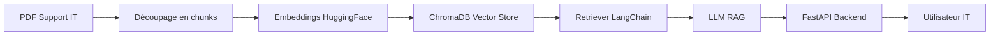

# IT-RAG Assistant ⚡🤖

**IT-RAG Assistant** est un **assistant intelligent interne** capable de répondre aux questions des techniciens IT à partir d’un **PDF de support IT** (procédures, incidents, FAQ). Il utilise les dernières technologies d’IA pour fournir des réponses fiables et contextuelles, tout en étant industrialisé, versionné et monitoré.

---

## 🚀 Objectif du projet

IT-RAG Assistant vise à :  
- Répondre rapidement aux **questions récurrentes** des techniciens IT  
- **Guider les interventions** lors d’incidents ou procédures complexes  
- **Centraliser et standardiser** les procédures IT à partir d’un PDF mis à jour  
- Fournir un service **fiable, évolutif et monitoré** grâce à un pipeline RAG industrialisé

---

## 💡 Fonctionnalités

- **Ingestion et préparation du PDF** : extraction et découpage en chunks avec métadonnées  
- **Recherche sémantique** : génération d’embeddings via HuggingFace + stockage dans ChromaDB  
- **Pipeline RAG** : LangChain pour générer des réponses précises à partir du PDF  
- **Backend FastAPI + PostgreSQL** : API sécurisée, gestion des utilisateurs et historique des questions  
- **Clustering non supervisé** : regroupe les questions fréquentes pour analyse  
- **Suivi et versionnement MLflow** : tracabilité et reproductibilité des modèles  
- **CI/CD & déploiement cloud-native** : Docker + Kubernetes pour un service scalable et monitoré  

---

## 🛠️ Technologies utilisées

| Composant | Technologie |
|------------|------------|
| LLM / RAG | LangChain, Gemini / HuggingFace |
| Extraction PDF | PyPDFLoader |
| Vector DB | ChromaDB |
| Backend | FastAPI, PostgreSQL |
| Clustering | KMeans (ML non supervisé) |
| Monitoring & versioning | MLflow |
| CI/CD & Déploiement | GitHub Actions, Docker, Kubernetes |

---

## ⚙️ Architecture



## 📦 Installation

1. Cloner le projet :

```
git clone https://github.com/Assma-IBIKAS/IT-RAG-Assistant.git
cd IT-RAG-Assistant
```
2. Créer un environnement Python :
```
python -m venv venv
source venv/bin/activate  # Linux/Mac
venv\Scripts\activate     # Windows
```
3. Installer les dépendances :
```
pip install -r requirements.txt
```
4. Configurer les variables d’environnement pour le LLM et PostgreSQL.

## 📊 Déploiement

* Docker + Kubernetes pour un déploiement scalable

* FastAPI pour exposer le backend

* MLflow pour le suivi et la version des modèles

* GitHub Actions pour automatiser CI/CD
## 🤝 Contribution

Contributions bienvenues !

* Fork le projet

* Créer une branche feature/ta-fonctionnalité

* Commit tes changements

* Pull request
